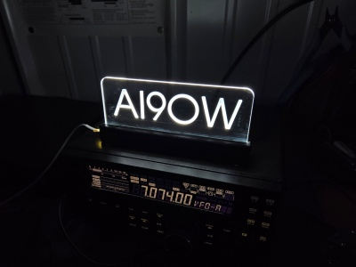
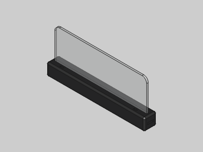
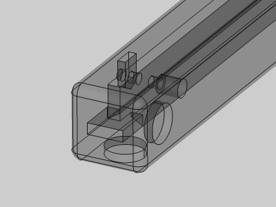
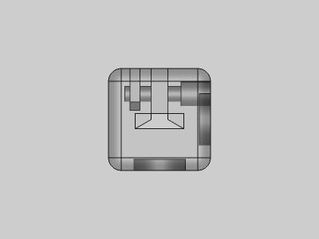

# Acrylic Light Stand

<table>
<tr>
<td></td>
<td></td>
</tr>
<tr>
<td></td>
<td></td>
</tr>
</table>

A parametric acrylic light stand. Uses two M2.5 bolts and nuts for holding acrylic, a battery powered LED light strip for lighting, and press-fit magnets on back and bottom for mounting. Made with FreeCAD.

**Design:** [acrylic-light-stand.FCStd](acrylic-light-stand.FCStd)

**STLs:**

* [acrylic_light_stand.stl](stl/acrylic_light_stand.stl)
* [press_fit_jig.stl](stl/press_fit_jig.stl)
* [press_fit_magnet_pusher.stl](stl/press_fit_magnet_pusher.stl)

**Recommended Print Settings:** 0.20mm layer height, 100% infill, no supports

**License**: 
